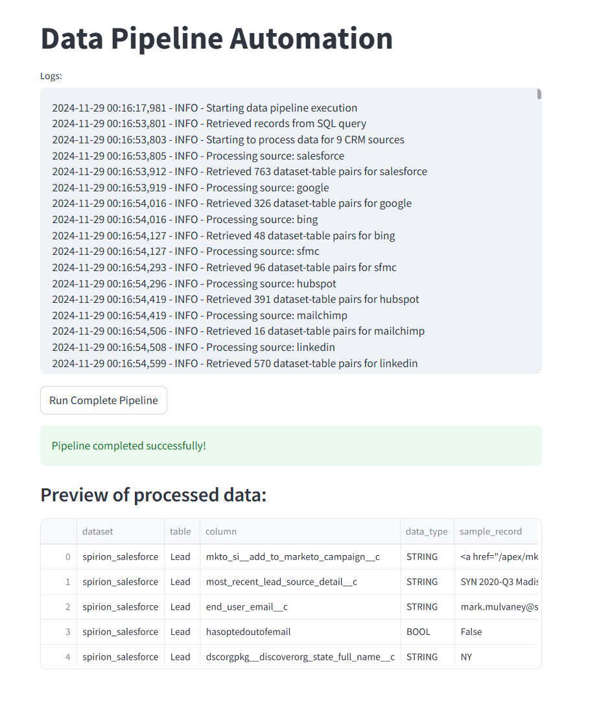

# :snake: Python DATA CATALOG Pipeline

## User Interface Overview



## Instruction

- After fetching you need create python environment 

    ```python
        python -m venv .venv
    ```
- Activate python environment in <code>.venv</code> directory

    ```python
        .venv/Scripts/activate
    ```
- Install requirements dependencies

    ```python
        pip install -r requirements.txt
    ```
- To run the the pipeline, run this command

    ```python
        python .\src\streamlit run app.py
    ```

## Pipeline Overview & Flow


