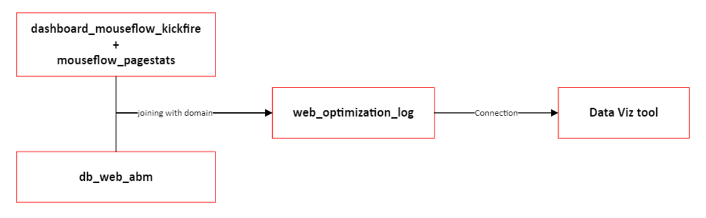

# Web Optimization

# Objective

To increase website ability to generate additional engagement via improved user experience.

# Plan

- Create segments and visibility over current metrics (baseline)
- Perform cohort analysis (based on dates) on segments to uncover metric trends across time
- Prioritize segments to optimize
- Analyze user experience flow to identify improvement opportunities

[Dashboard Link](https://lookerstudio.google.com/reporting/8b18471d-3d49-417b-b357-7de99444f68b)

# Data Flow

# Data Dictionary

## dashboard_mouseflow_kickfire

| Field Name | Source | Data Type | Description | Example |
| --- | --- | --- | --- | --- |
| recordingURL | Mouseflow | String | The recording URL for each recording ID | https://us.mouseflow.com/websites/... |
| recordingID | Mouseflow | String | Recording ID for each session | d7489d3ded8033fba9547d0463a02ff1 |
| visitorID | Mouseflow | String | Visitor ID for each session | 38aa54061ab2050b4a7106dc0dd0698e |
| entryPage | Mouseflow | String | Entry page for each of the recording | /alumni |
| entryURL | Mouseflow | String | The URL for each Entry | https://www.sandler.com/alumni/ |
| cleanPage | Mouseflow | String | Clean page that removes parameter | https://www.sandler.com/alumni/ |
| nextPage | Mouseflow | String | Next page on the visitor’s journey | https://www.sandler.com/who-we-serve/ |
| Timestamp | Mouseflow | Timestamp | Timestamp of the recording | 2023-05-08 22:50:37 UTC |
| utmSource | Mouseflow | String | The utm source in the URL | googleads |
| utmCampaign | Mouseflow | String | The utm campaign in the URL | sandlerbrand |
| utmContent | Mouseflow | String | The utm content in the URL | rsa_2 |
| City | Mouseflow | String | City of the Account captured | Brentwood |
| region | Mouseflow | String | Region of the Account captured | Tennessee |
| Country | Mouseflow | String | Country of the Account captured | us |
| ipAddr | Mouseflow | String | IP Address of Account captured | 31.223.58.68 |
| totalSessionsViews | Mouseflow | Integer | Total of Sessions views per recording | 12 |
| viewID | Mouseflow | String | The view ID | 05073036de39cf53d9c1310247a294298b407cdf |
| Engagementtime | Mouseflow | Float | Engagement Time per recording | 29.2 |
| Location | Mouseflow | String | Location of the Account captured | Atlanta, Georgia |
| Industry | Mouseflow | String | Industry of the Account captured | Packaging Paper and Plastics Film, Coated and Laminated |
| Domain | Mouseflow | String | Domain of the Account captured | westrock.com |
| Name | Mouseflow | String | Name of the Account captured | WestRock Company |
| webActivity | Mouseflow | String | The visitor’s journey | /, 
/sales-training |
| webActivityURL | Mouseflow | String | The visitor’s journey URL | https://www.sandler.com/, 
 https://www.sandler.com/sales-training/ |

## mouseflow_pagestats

| Field Name | Source | Data Type | Description | Example |
| --- | --- | --- | --- | --- |
| clicks | Mouseflow pagestats | Integer | Number of clicks per recording | 387 |
| scroll | Mouseflow pagestats | Integer | Number of scrolls per recording | 70 |

## web_abm

| Field Name | Source | Data Type | Description | Example |
| --- | --- | --- | --- | --- |
| Tier | Web_abm | String | Tier in the web abm | Tier 2 |

## custom fields

| Field Name | Source | Data Type | Description | Example |
| --- | --- | --- | --- | --- |
| accountType | Custom (BQ) | String | Check the account type if ABM or others | ABM |
| userType | Custom (BQ) | String | Type of user(visitorID) – Returning or New | Returning |
| accountVisit | Custom (BQ) | String | Type of account(domain) – Returning or New | New |
| potentialBot | Custom (BQ) | String | Engagement time < 5s | TRUE |
| _consideration | Custom (looker) | Text | When page in ('/leadership-training','/sales-training','/who-we-serve','/get-started') | {visitorID} |
| Total page viewed | Custom (looker) | Number | Total number of page viewed | 13 |
| Total unique visitors | Custom (looker) | Number | Number of unique visitors | 162600 |
| Avg engagement time | Custom (looker) | Number | Sum of engagement time / total unique visitors | 00:00:43 |
| Total recordings | Custom (looker) | Number | Number of recordings | 134 |
| Avg pages viewed | Custom (looker) | Number | sum of total page viewed / total unique visitors | 1.7 |
| No next page | Custom (looker) | Number | Count if there’s next page for the recording | 15 |
| Progress to consideration | Custom (looker) | Number | Number of consideration / number of visitorid | 4.24% |
| Single page view % | Custom (looker) | Number | NoNextPage / total Recordings | 1 |